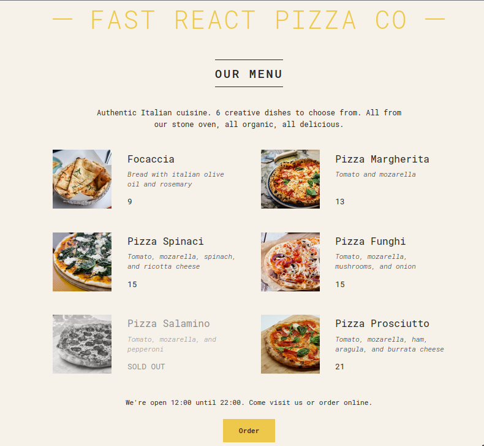

# README untuk Pemula: Membuat Aplikasi Pizza dengan React

## Deskripsi Umum

Pada aplikasi ini, kita akan membuat sebuah **aplikasi restoran pizza sederhana** menggunakan React. Aplikasi ini akan menampilkan daftar menu pizza yang disertai dengan gambar, deskripsi, harga, dan status apakah pizza tersebut tersedia atau sudah habis. Pengguna juga akan melihat jam operasional restoran dan dapat memesan pizza jika restoran sedang buka.

<p align="center">
  
</p>

## Tujuan Kode

Tujuan utama dari aplikasi ini adalah untuk:

1. Mengerti cara membangun aplikasi sederhana menggunakan React.
2. Memahami bagaimana menggunakan **state** dan **props** untuk mengelola data dan mengirim data antar komponen.
3. Menggunakan **conditional rendering** untuk menampilkan konten yang berbeda berdasarkan status (misalnya, apakah restoran buka atau tutup).
4. Belajar bagaimana menggunakan **komponen yang dapat digunakan kembali** di React, seperti komponen `Pizza`, `Header`, `Menu`, dan `Footer`.

## Fungsi Kode

Aplikasi ini terdiri dari beberapa bagian yang berfungsi sebagai berikut:

- **Header**: Menampilkan judul aplikasi.
- **Menu**: Menampilkan daftar pizza dan informasi terkait.
- **Pizza**: Menampilkan informasi tentang setiap pizza (nama, bahan, harga, gambar, dan status "sold out").
- **Footer**: Menampilkan informasi tentang jam buka restoran dan opsi untuk memesan pizza.
- **Order**: Menampilkan tombol untuk memesan pizza saat restoran buka.

## Penjelasan Kode

Mari kita bahas bagian-bagian utama dari kode ini.

### 1. **Data Pizza (`pizzaData`)**

```javascript
const pizzaData = [
  {
    name: "Focaccia",
    ingredients: "Bread with italian olive oil and rosemary",
    price: 6,
    photoName: "pizzas/focaccia.jpg",
    soldOut: false,
  },
  // ... data lainnya
];
```

`pizzaData` adalah array yang berisi objek-objek yang menggambarkan menu pizza. Setiap objek pizza memiliki beberapa atribut:

- `name`: Nama pizza.
- `ingredients`: Bahan-bahan pizza.
- `price`: Harga pizza.
- `photoName`: Nama file gambar pizza.
- `soldOut`: Menyatakan apakah pizza ini sudah habis atau tidak.

### 2. **Komponen `App`**

```javascript
function App() {
  return (
    <div className="container">
      <Header />
      <Menu />
      <Footer />
    </div>
  );
}
```

Komponen `App` adalah komponen utama yang merender keseluruhan aplikasi. Di sini, kita memanggil tiga komponen lainnya:

- `Header`: Untuk menampilkan nama restoran.
- `Menu`: Untuk menampilkan daftar pizza.
- `Footer`: Untuk menampilkan informasi jam buka restoran.

### 3. **Komponen `Header`**

```javascript
function Header() {
  const style = {};

  return (
    <header className="header">
      <h1 style={style} className="header">
        Fast React Pizza Co
      </h1>
    </header>
  );
}
```

Komponen `Header` hanya menampilkan nama restoran dalam tag `<h1>`. Kamu bisa menambahkan gaya dengan menggunakan objek `style` (meskipun dalam kode ini, `style` belum diubah).

### 4. **Komponen `Menu`**

```javascript
function Menu() {
  const pizzas = pizzaData;
  const numPizzas = pizzas.length;

  return (
    <main className="menu">
      <h2>Our Menu</h2>

      {numPizzas > 0 ? (
        <Fragment>
          <p>
            Authentic Italian cuisine. 6 creative dishes to choose from. All
            from our stone oven, all organic, all delicious.
          </p>
          <ul className="pizzas">
            {pizzaData.map((pizza) => (
              <Pizza pizzaObj={pizza} key={pizza.name} />
            ))}
          </ul>
        </Fragment>
      ) : (
        <p>We're still working on our menu. Please come back later</p>
      )}
    </main>
  );
}
```

Komponen `Menu` menampilkan daftar pizza yang ada. Jika ada pizza (dengan memeriksa `numPizzas`), maka setiap pizza akan dirender menggunakan komponen `Pizza`. Jika tidak ada pizza, maka menampilkan pesan bahwa menu masih dalam pengembangan.

### 5. **Komponen `Pizza`**

```javascript
function Pizza({ pizzaObj }) {
  return (
    <li className={pizzaObj.soldOut ? "pizza sold-out" : "pizza"}>
      
      <div>
        <h3>{pizzaObj.name}</h3>
        <p>{pizzaObj.ingredients}</p>
        <span>{pizzaObj.soldOut ? "SOLD OUT" : pizzaObj.price + 3}</span>
      </div>
    </li>
  );
}
```

Komponen `Pizza` menerima `pizzaObj` sebagai prop dan merender informasi pizza. Jika pizza tersebut sudah habis (`soldOut`), maka kelas CSS `sold-out` akan ditambahkan. Gambar pizza juga akan ditampilkan dengan menggunakan tag ``.

### 6. **Komponen `Footer`**

```javascript
function Footer() {
  const hour = new Date().getHours();
  const openHour = 12;
  const closeHour = 22;
  const isOpen = hour >= openHour && hour <= closeHour;

  return (
    <footer className="footer">
      {isOpen ? (
        <Order closeHour={closeHour} openHour={openHour} />
      ) : (
        <p>
          We're happy to welcome you between {openHour}:00 and {closeHour}:00
        </p>
      )}
    </footer>
  );
}
```

Komponen `Footer` akan mengecek jam sekarang dan menentukan apakah restoran buka atau tidak. Jika buka, akan menampilkan komponen `Order` untuk memungkinkan pemesanan pizza. Jika restoran tutup, akan muncul pesan yang memberi tahu jam buka restoran.

### 7. **Komponen `Order`**

```javascript
function Order({ closeHour, openHour }) {
  return (
    <div className="order">
      <p>
        We're open {openHour}:00 until {closeHour}:00. Come visit us or order
        online.
      </p>
      <button className="btn">Order</button>
    </div>
  );
}
```

Komponen `Order` hanya menampilkan tombol pemesanan jika restoran sedang buka.

## Cara Berpikir di React

Berpikir dalam React berarti memecah UI menjadi **komponen-komponen kecil** yang dapat digunakan kembali. Setiap komponen bertanggung jawab atas satu bagian tampilan aplikasi dan menerima data melalui **props**. Komponen ini kemudian merender UI berdasarkan data yang diterima dan bisa juga melakukan **conditional rendering** untuk menampilkan konten yang berbeda, misalnya menampilkan status "SOLD OUT" pada pizza yang tidak tersedia.

## Analogi Sederhana

Bayangkan React seperti restoran pizza. Setiap komponen dalam aplikasi adalah bagian dari restoran:

- **Header** adalah papan nama restoran.
- **Menu** adalah daftar pizza yang tersedia.
- **Pizza** adalah setiap menu pizza yang bisa dipesan.
- **Footer** adalah informasi jam buka restoran.
- **Order** adalah tempat pelanggan bisa memesan pizza.

Setiap bagian bekerja sama untuk memberikan pengalaman yang utuh dan dinamis bagi pelanggan (pengguna aplikasi).

## Kesimpulan

- **React** memungkinkan kita untuk membangun aplikasi dengan membagi UI menjadi komponen-komponen kecil yang dapat digunakan kembali.
- **Props** digunakan untuk mengirimkan data ke komponen anak dan mempengaruhi bagaimana UI dirender.
- **Conditional rendering** membantu kita menampilkan elemen berbeda berdasarkan kondisi tertentu (misalnya restoran buka atau tutup, atau pizza sudah habis atau tidak).
- React memberi kita fleksibilitas untuk membangun aplikasi yang dinamis dan mudah dikelola.

Dengan memahami konsep-konsep ini, kamu akan siap untuk membangun aplikasi React yang lebih kompleks di masa depan!
