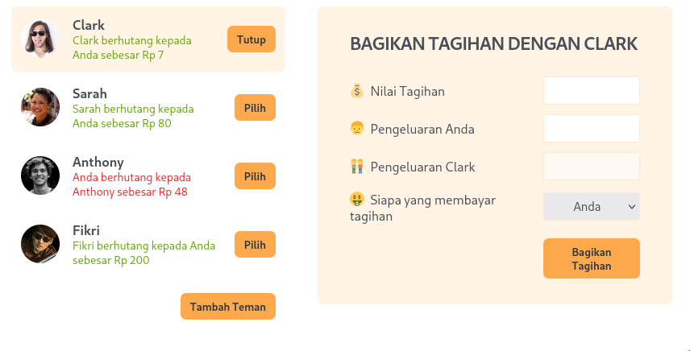

# **README: Aplikasi Pembagian Tagihan Teman dengan React**

Aplikasi ini memungkinkan Anda untuk mengelola daftar teman, menambah teman baru, dan membagi tagihan dengan teman yang dipilih. Setiap teman memiliki saldo yang menunjukkan apakah mereka berhutang kepada Anda atau sebaliknya.

<p align="center">
  
</p>

Berikut adalah panduan yang jelas dan ramah untuk pemula agar Anda dapat memahami cara kerja aplikasi ini dengan baik.

---

## **1. Pengertian Program**

Program ini adalah aplikasi pembagian tagihan sederhana yang menggunakan React. Fitur utama program ini meliputi:

- **Menambah Teman**: Anda bisa menambahkan teman baru ke dalam daftar.
- **Membagi Tagihan**: Anda dapat membagi tagihan dengan teman yang dipilih.
- **Melihat Saldo**: Melihat apakah teman berhutang kepada Anda atau sebaliknya.

### **Bagaimana Program Ini Bekerja?**

- Anda bisa menambah teman baru ke dalam aplikasi.
- Setelah memilih teman, Anda bisa memasukkan jumlah tagihan dan siapa yang membayar.
- Saldo teman akan dihitung dan diperbarui sesuai dengan pembayaran yang dilakukan.

---

## **2. Teknologi yang Digunakan**

Aplikasi ini dibangun dengan menggunakan **React**, sebuah pustaka JavaScript yang memungkinkan kita untuk membuat antarmuka pengguna yang dinamis.

### **Library yang Digunakan:**

- **React**: Untuk membangun UI dan menangani perubahan state.
- **useState**: Hook React untuk mengelola state seperti daftar teman, status form, dan saldo.
- **CSS**: Untuk memberi tampilan visual yang menarik pada aplikasi.

---

## **3. Konsep Dasar React yang Perlu Dipahami**

React bekerja dengan menggunakan **komponen** yang terpisah untuk setiap bagian dari antarmuka pengguna. Komponen-komponen ini saling berinteraksi melalui **state** dan **props**.

- **Komponen** adalah bagian dari UI (seperti tombol, daftar teman, form).
- **State** menyimpan data yang bisa berubah, seperti daftar teman atau saldo.
- **Props** adalah cara untuk mengirim data dari satu komponen ke komponen lainnya.

---

## **4. Langkah-langkah Membuat Program Ini**

Berikut adalah langkah-langkah sederhana dalam membangun aplikasi ini:

1. **Persiapkan Data Teman**: Mulai dengan mendefinisikan data teman yang sudah ada.
2. **Buat Komponen Button**: Sebuah tombol yang digunakan untuk interaksi pengguna.
3. **Buat Form untuk Menambah Teman**: Form ini memungkinkan pengguna untuk menambah teman baru.
4. **Buat Fungsi Pembagian Tagihan**: Pengguna bisa membagi tagihan dengan teman yang dipilih, dan saldo teman akan diperbarui.
5. **Handle State**: Gunakan `useState` untuk mengelola status aplikasi seperti data teman, form, dan saldo tagihan.

---

## **5. Penjelasan Kode per Bagian**

### **Komponen Button**

Komponen ini hanya sebuah tombol yang bisa diklik dan menjalankan fungsi yang diterima dari props `onClick`.

```jsx
function Button({ children, onClick }) {
  return (
    <button className="button" onClick={onClick}>
      {children}
    </button>
  );
}
```

### **Komponen App**

Komponen utama yang mengelola seluruh aplikasi, termasuk state untuk teman, form, dan status pemilihan teman.

```jsx
function App() {
  const [friends, setFriends] = useState(initialFriends); // Menyimpan daftar teman
  const [showAddFriend, setShowAddFriend] = useState(false); // Menyimpan status apakah form tambah teman ditampilkan
  const [selectedFriend, setSelectedFriend] = useState(null); // Menyimpan teman yang dipilih untuk pembagian tagihan
}
```

Fungsi `handleShowAddFriend` akan mengubah status `showAddFriend` untuk menampilkan atau menyembunyikan form tambah teman.

```jsx
function handleShowAddFriend() {
  setShowAddFriend((show) => !show);
  setSelectedFriend(null);
}
```

### **Komponen FriendsList**

Komponen ini merender daftar teman yang ada. Setiap teman akan menjadi komponen `Friend`.

```jsx
function FriendsList({ friends, onSelection, selectedFriend }) {
  return (
    <ul>
      {friends.map((friend) => (
        <Friend
          friend={friend}
          key={friend.id}
          onSelection={onSelection}
          selectedFriend={selectedFriend}
        />
      ))}
    </ul>
  );
}
```

### **Komponen Friend**

Komponen ini menampilkan informasi tentang teman, apakah mereka berhutang kepada kita atau sebaliknya, serta tombol untuk memilih teman tersebut.

```jsx
function Friend({ friend, onSelection, selectedFriend }) {
  const isSelected = selectedFriend?.id === friend.id;
  return (
    <li className={isSelected ? "selected" : ""}>
      
      <h3>{friend.name}</h3>
      <Button onClick={() => onSelection(friend)}>
        {isSelected ? "Tutup" : "Pilih"}
      </Button>
    </li>
  );
}
```

### **Komponen FormAddFriend**

Form ini memungkinkan pengguna untuk menambah teman baru ke dalam daftar.

```jsx
function FormAddFriend({ onAddFriend }) {
  const [name, setName] = useState("");
  const [image, setImage] = useState("https://i.pravatar.cc/48?u=499476");

  function handleSubmit(e) {
    e.preventDefault();
    if (!name || !image) return;

    const newFriend = {
      id: crypto.randomUUID(),
      name,
      image: `${image}?=${id}`,
      balance: 0,
    };

    onAddFriend(newFriend);
    setName("");
    setImage("https://i.pravatar.cc/48?u=499476");
  }

  return (
    <form className="form-add-friend" onSubmit={handleSubmit}>
      <label>Nama Teman</label>
      <input
        type="text"
        value={name}
        onChange={(e) => setName(e.target.value)}
      />
      <label>URL Gambar</label>
      <input
        type="text"
        value={image}
        onChange={(e) => setImage(e.target.value)}
      />
      <Button>Tambah</Button>
    </form>
  );
}
```

### **Komponen FormSplitBill**

Form ini memungkinkan Anda untuk membagi tagihan dengan teman yang dipilih. Anda dapat memasukkan nilai tagihan dan siapa yang akan membayar.

```jsx
function FormSplitBill({ selectedFriend, onSplitBill }) {
  const [bill, setBill] = useState("");
  const [paidByUser, setPaidByUser] = useState("");
  const paidByFriend = bill ? bill - paidByUser : "";
  const [whoIsPaying, setWhoIsPaying] = useState("user");

  function handleSubmit(e) {
    e.preventDefault();
    if (!bill || !paidByUser) return;
    onSplitBill(whoIsPaying === "user" ? paidByFriend : -paidByUser);
  }

  return (
    <form className="form-split-bill" onSubmit={handleSubmit}>
      <label>Nilai Tagihan</label>
      <input
        type="text"
        value={bill}
        onChange={(e) => setBill(Number(e.target.value))}
      />
      <Button>Bagikan Tagihan</Button>
    </form>
  );
}
```

---

## **6. Analogi Sederhana untuk Memahami Program Ini**

Bayangkan Anda memiliki buku catatan yang berisi daftar teman-teman Anda. Setiap teman memiliki halaman yang mencatat saldo hutang atau piutang kepada Anda. Anda bisa menambah teman baru ke dalam buku, memilih teman yang ingin dibagi tagihan, dan menghitung berapa yang harus dibayar atau diterima oleh setiap orang.

---

## **7. Kesimpulan**

Aplikasi ini memberikan gambaran yang baik tentang cara kerja **React** dan bagaimana kita bisa menggunakan **state** dan **props** untuk mengelola data dan interaksi antar komponen. Dengan pemahaman dasar tentang komponen, state, dan props, Anda dapat dengan mudah memperluas aplikasi ini untuk menambah fitur-fitur lainnya.

Program ini sangat cocok untuk pemula yang ingin mempelajari **React** dan bagaimana membangun aplikasi web interaktif dengan antarmuka yang sederhana.

Semoga panduan ini membantu Anda memahami cara kerja aplikasi ini! Happy coding! 🚀
