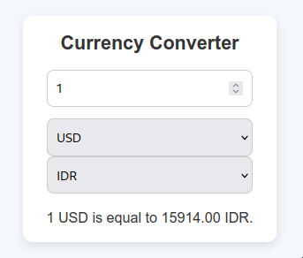

# README - Currency Converter

## Pengertian

Currency Converter adalah aplikasi web sederhana yang digunakan untuk mengkonversi jumlah uang dari satu mata uang ke mata uang lainnya. Aplikasi ini menggunakan API untuk mendapatkan nilai tukar (exchange rate) mata uang secara real-time. Pengguna dapat memilih mata uang asal dan tujuan serta memasukkan jumlah uang yang ingin dikonversi. Hasil konversi akan ditampilkan dengan otomatis setelah proses validasi dan pengambilan data.

<div align="center">
  
</div>

## Cara Berpikir React

React adalah pustaka JavaScript untuk membangun antarmuka pengguna (UI) yang interaktif. Dalam React, kita bekerja dengan **komponen** yang dapat mengelola **state** dan **efek samping**. Komponen ini bisa dianggap sebagai "kotak" kecil yang berisi logika dan UI yang dapat digunakan kembali.

Pada aplikasi ini, kita akan mengelola:

- **State**: Menyimpan data yang akan digunakan dalam UI (seperti jumlah uang, mata uang asal dan tujuan, dan hasil konversi).
- **Effect**: Menangani efek samping, seperti mengambil data dari API saat nilai input atau pilihan mata uang berubah.

## Analogi Sederhana

Bayangkan kita memiliki mesin penghitung uang yang dapat mengkonversi mata uang. Mesin ini membutuhkan 3 hal:

1. **Jumlah uang yang ingin dikonversi**.
2. **Mata uang asal**.
3. **Mata uang tujuan**.

Ketika kita memberikan semua input tersebut, mesin ini akan memberikan kita hasil konversi, tetapi selama prosesnya, kita harus menunggu sebentar (loading). Jika ada kesalahan, mesin ini akan memberitahukan kita (misalnya, jika jumlah uang yang dimasukkan tidak valid).

## Penjelasan Code Tiap Baris

### 1. Mengimpor React Hooks dan CSS

```javascript
import { useEffect, useState } from "react"; // Mengimpor hook React: useState untuk state dan useEffect untuk efek samping (side effects)
import "./App.css"; // Mengimpor file CSS untuk styling
```

- `useState` digunakan untuk mengelola state (nilai variabel) dalam komponen.
- `useEffect` digunakan untuk menangani efek samping, seperti melakukan pemanggilan API saat data berubah.
- `App.css` digunakan untuk memberikan styling (penampilan) pada aplikasi.

### 2. Mendeklarasikan State

```javascript
const [amount, setAmount] = useState(100); // Menginisialisasi state amount dengan nilai default 100
const [fromCurrency, setFromCurrency] = useState("USD"); // Menginisialisasi state fromCurrency dengan nilai default "USD"
const [toCurrency, setToCurrency] = useState("EUR"); // Menginisialisasi state toCurrency dengan nilai default "EUR"
const [rate, setRate] = useState(0); // Menginisialisasi state rate untuk menyimpan nilai tukar, default 0
const [isLoading, setIsLoading] = useState(false); // Menginisialisasi state isLoading untuk menandakan apakah data sedang dimuat, default false
const [error, setError] = useState(null); // Menginisialisasi state error untuk menyimpan pesan error, default null (tidak ada error)
```

- `amount`: jumlah uang yang ingin dikonversi.
- `fromCurrency`: mata uang asal.
- `toCurrency`: mata uang tujuan.
- `rate`: nilai tukar mata uang yang digunakan untuk konversi.
- `isLoading`: status untuk menunjukkan apakah aplikasi sedang memuat data.
- `error`: menyimpan pesan error jika ada kesalahan.

### 3. Efek Samping untuk Fetch Data

```javascript
useEffect(() => {
  if (isNaN(amount) || amount <= 0) {
    setError("Please enter a valid amount."); // Jika amount tidak valid, set error message
    setRate(0); // Mengatur rate menjadi 0
    return; // Hentikan eksekusi jika amount tidak valid
  }

  async function fetchCurrency() {
    setIsLoading(true); // Menandakan bahwa data sedang dimuat
    setError(null); // Reset error state sebelum mulai fetch

    try {
      const res = await fetch(
        `https://api.frankfurter.app/latest?amount=${amount}&from=${fromCurrency}&to=${toCurrency}`
      );
      if (!res.ok) throw new Error("Failed to fetch data"); // Jika response tidak berhasil, lempar error

      const data = await res.json(); // Mengubah data JSON dari API
      setRate(data.rates[toCurrency]); // Mengupdate rate berdasarkan data yang diterima
    } catch (error) {
      if (error.name !== "AbortError") {
        setError("Failed to fetch exchange rate. Please try again."); // Menangani error
      }
    } finally {
      setIsLoading(false); // Menandakan bahwa data sudah selesai dimuat
    }
  }

  if (fromCurrency === toCurrency) {
    setRate(amount); // Jika mata uang sama, langsung set rate menjadi jumlah yang dimasukkan
  } else {
    fetchCurrency(); // Jika mata uang berbeda, panggil fetchCurrency untuk mengambil data
  }
}, [amount, fromCurrency, toCurrency]); // Efek ini dijalankan ulang jika amount, fromCurrency, atau toCurrency berubah
```

- **Validasi Amount**: Mengecek apakah jumlah uang yang dimasukkan valid.
- **Fetch Data**: Jika valid, aplikasi akan mengambil nilai tukar mata uang menggunakan `fetch` ke API.
- **Error Handling**: Menangani kesalahan jika fetch gagal, dan menampilkan pesan error.
- **Loading**: Status loading diatur selama proses fetch berlangsung.

### 4. Tampilan (UI)

```javascript
return (
  <div className="app-container">
    <div className="card">
      <h1>Currency Converter</h1>

      <div className="input-group">
        <input
          type="number"
          min="0"
          step="any"
          onChange={(e) => setAmount(Number(e.target.value))}
          value={amount}
          placeholder="Enter amount"
        />
      </div>

      <div className="select-group">
        <select
          value={fromCurrency}
          onChange={(e) => setFromCurrency(e.target.value)}
        >
          <option value="IDR">IDR</option>
          <option value="USD">USD</option>
          <option value="EUR">EUR</option>
          <option value="CAD">CAD</option>
          <option value="INR">INR</option>
        </select>
        <select
          value={toCurrency}
          onChange={(e) => setToCurrency(e.target.value)}
        >
          <option value="IDR">IDR</option>
          <option value="USD">USD</option>
          <option value="EUR">EUR</option>
          <option value="CAD">CAD</option>
          <option value="INR">INR</option>
        </select>
      </div>

      <div className="result">
        {error && <div className="error">{error}</div>}
        {isLoading ? (
          <div className="loading">Loading...</div>
        ) : rate > 0 ? (
          <p>
            {amount} {fromCurrency} is equal to {rate.toFixed(2)} {toCurrency}
          </p>
        ) : (
          <p>
            Please enter an amount and select currencies to see the conversion.
          </p>
        )}
      </div>
    </div>
  </div>
);
```

- **Input Amount**: Pengguna memasukkan jumlah uang yang ingin dikonversi.
- **Dropdown Currency**: Pengguna memilih mata uang asal dan tujuan.
- **Hasil Konversi**: Menampilkan hasil konversi atau pesan error jika terjadi masalah.

## Kesimpulan

Aplikasi Currency Converter ini menggunakan React untuk menangani input pengguna, mengambil data nilai tukar secara real-time, dan menampilkan hasil konversi. Penggunaan React Hooks (`useState` dan `useEffect`) memungkinkan aplikasi untuk merespons perubahan state secara otomatis dan melakukan pemanggilan API yang efisien. Dengan pemahaman dasar tentang React, aplikasi ini dapat menjadi contoh yang baik untuk memahami cara kerja state, efek samping, dan penanganan data dalam aplikasi web.
