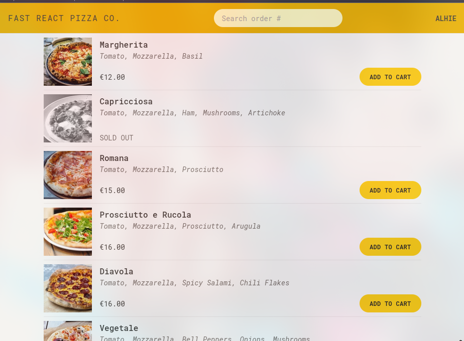

# **Pizza Ordering App with React Router 6**

Aplikasi pemesanan pizza ini dibangun menggunakan **React** dan **React Router 6** untuk menangani navigasi antar halaman. Aplikasi ini memungkinkan pengguna untuk memilih pizza, melihat keranjang belanja, dan membuat pesanan. Proyek ini memanfaatkan berbagai fitur **React Router 6**, seperti **path dinamis**, **nested routes**, **loaders**, dan **actions** untuk membangun pengalaman pengguna yang mulus dan dinamis.

<p align="center">
  
</p>

## **Daftar Isi**

1. [Pengertian React Router 6](#pengertian-react-router-6)
2. [Cara Berpikir React Router](#cara-berpikir-react-router)
3. [Menyiapkan Routing di Aplikasi](#menyiapkan-routing-di-aplikasi)
4. [Struktur Routing di Proyek Ini](#struktur-routing-di-proyek-ini)
5. [Penjelasan Setiap Bagian Kode](#penjelasan-setiap-bagian-kode)
6. [Kesimpulan](#kesimpulan)

---

## **Pengertian React Router 6**

**React Router** adalah pustaka untuk mengelola navigasi antar komponen dalam aplikasi **React**. Dengan React Router, kita dapat menavigasi antar halaman tanpa memuat ulang seluruh aplikasi (single-page application). React Router 6 adalah versi terbaru yang menyediakan cara yang lebih sederhana dan lebih terstruktur untuk menangani rute di aplikasi React.

### **Fitur Utama React Router 6:**

- **Declarative Routing**: Menentukan rute secara deklaratif, artinya kita menyebutkan komponen mana yang akan dirender untuk setiap path.
- **Nested Routes**: Mengatur rute yang memiliki struktur hierarkis.
- **Dynamic Routes**: Rute dengan parameter yang dapat disesuaikan, misalnya untuk halaman dengan ID unik seperti pesanan atau produk.
- **Loader dan Action**: Fungsi yang dijalankan sebelum atau setelah perubahan rute untuk mengambil data atau melakukan aksi.

---

## **Cara Berpikir React Router**

Sebelum kita masuk ke kode, mari kita pahami dulu **cara berpikir React Router** dalam aplikasi.

### **1. Routing Berbasis URL**

- React Router memungkinkan aplikasi berpindah antar "halaman" berdasarkan **URL**. Setiap URL yang diakses akan memicu komponen yang relevan untuk dirender.

  Misalnya, jika pengguna mengakses `/menu`, maka komponen **`Menu`** akan dirender. Ini memungkinkan kita membuat aplikasi dengan banyak "halaman", tetapi hanya menggunakan satu halaman (SPA).

### **2. Path dan Komponen**

- **Path**: URL yang kita tentukan untuk setiap rute. Contoh: `/menu`, `/cart`, `/order/:orderId`.
- **Komponen**: Komponen React yang akan dirender ketika pengguna mengakses suatu path.

### **3. Dynamic Routes**

- Dengan menggunakan parameter dalam path (seperti `:orderId`), kita bisa menangani halaman dinamis yang menampilkan konten berdasarkan data yang diterima dari URL.

### **4. Nested Routes dan Layouts**

- **Nested Routes** memungkinkan kita membuat struktur rute hierarkis di dalam komponen yang lebih besar (seperti layout). Ini memungkinkan kita memiliki komponen **layout** bersama dengan komponen **anak** yang spesifik.

---

## **Menyiapkan Routing di Aplikasi**

Di dalam aplikasi ini, kita menggunakan **React Router 6** untuk mengatur semua rute dan navigasi. Ada dua komponen utama yang digunakan dalam routing:

1. **`createBrowserRouter`**: Digunakan untuk mendefinisikan semua rute di aplikasi.
2. **`RouterProvider`**: Menyediakan router ke seluruh aplikasi.

---

## **Struktur Routing di Proyek Ini**

Di bawah ini adalah struktur dasar dari routing di aplikasi pizza ini:

```javascript
import { createBrowserRouter, RouterProvider } from "react-router-dom";
import Home from "./ui/Home";
import Error from "./ui/Error";
import Menu, { loader as menuLoader } from "./features/menu/Menu";
import Cart from "./features/cart/Cart";
import CreateOrder, {
  action as createOrderAction,
} from "./features/order/CreateOrder";
import Order, { loader as orderLoader } from "./features/order/Order";
import AppLayout from "./ui/AppLayout";

const router = createBrowserRouter([
  {
    element: <AppLayout />,
    errorElement: <Error />,
    children: [
      {
        path: "/",
        element: <Home />,
      },
      {
        path: "/menu",
        element: <Menu />,
        loader: menuLoader,
      },
      { path: "/cart", element: <Cart /> },
      {
        path: "/order/new",
        element: <CreateOrder />,
        action: createOrderAction,
      },
      {
        path: "/order/:orderId",
        element: <Order />,
        loader: orderLoader,
        errorElement: <Error />,
      },
    ],
  },
]);

function App() {
  return <RouterProvider router={router} />;
}

export default App;
```

### **Penjelasan Struktur Routing**

1. **`createBrowserRouter([...])`**:

   - Fungsi ini digunakan untuk mendefinisikan seluruh struktur rute aplikasi. Rute-rute tersebut termasuk path, komponen yang dirender, dan fungsi-fungsi seperti **loader** dan **action**.

2. **`AppLayout`**:

   - **`AppLayout`** adalah komponen layout yang akan membungkus semua halaman aplikasi, memberikan struktur umum seperti header, footer, dan keranjang belanja.

3. **`path` dan `element`**:

   - **`path`** adalah URL yang akan mengarahkan ke rute tertentu.
   - **`element`** adalah komponen React yang akan dirender saat URL yang sesuai diakses.

4. **`loader` dan `action`**:

   - **`loader`**: Fungsi yang dipanggil sebelum halaman dirender untuk memuat data. Misalnya, di halaman **Menu**, kita menggunakan loader untuk mengambil data menu.
   - **`action`**: Fungsi yang dipanggil saat sebuah formulir dikirim (misalnya, untuk membuat pesanan).

5. **`errorElement`**:
   - Digunakan untuk menangani kesalahan yang terjadi saat memuat halaman atau data.

---

## **Penjelasan Setiap Bagian Kode**

Berikut adalah penjelasan lebih rinci tentang beberapa bagian kunci dari kode ini:

### **`AppLayout.js`**

Di dalam komponen layout (`AppLayout`), kita menggunakan **`<Outlet />`** untuk menentukan di mana komponen-komponen anak akan dirender.

```javascript
import { Outlet } from "react-router-dom";

const AppLayout = () => {
  return (
    <div className="layout">
      <Header />
      <main>
        <Outlet />
      </main>
      <CartOverview />
    </div>
  );
};

export default AppLayout;
```

- **`<Outlet />`**: Tempat di mana halaman-halaman yang ditentukan dalam **`createBrowserRouter`** (seperti `Home`, `Menu`, `Cart`) akan dirender. Komponen ini memungkinkan halaman dinamis ditampilkan di dalam layout yang sama.

---

### **`Menu.js`** - Menggunakan `loader`

Di dalam **`Menu.js`**, kita menggunakan **`loader`** untuk mengambil data menu sebelum halaman dirender.

```javascript
import { useLoaderData } from "react-router-dom";
import { getMenu } from "../../services/apiRestaurant";

function Menu() {
  const menu = useLoaderData(); // Mengambil data menu
  return (
    <ul>
      {menu.map((pizza) => (
        <li key={pizza.id}>{pizza.name}</li>
      ))}
    </ul>
  );
}

export async function loader() {
  const menu = await getMenu(); // Mengambil data menu
  return menu;
}

export default Menu;
```

- **`useLoaderData()`**: Hook ini digunakan untuk mendapatkan data yang diambil oleh **loader**.
- **`loader()`**: Fungsi ini akan mengambil data dari API sebelum halaman **Menu** dirender.

---

### **`Order.js`** - Menggunakan `loader` dan `params`

Di halaman **`Order.js`**, kita menggunakan **`useParams`** untuk mendapatkan **`orderId`** dari URL dan **`loader`** untuk mengambil data pesanan berdasarkan ID tersebut.

```javascript
import { useLoaderData, useParams } from "react-router-dom";
import { getOrder } from "../../services/apiRestaurant";

function Order() {
  const { orderId } = useParams(); // Mendapatkan orderId dari URL
  const order = useLoaderData(); // Mengambil data pesanan berdasarkan orderId
  return (
    <div>
      <h2>Order ID: {order.id}</h2>
      <p>Status: {order.status}</p>
    </div>
  );
}

export async function loader({ params }) {
  const order = await getOrder(params.orderId); // Mengambil data pesanan
  return order;
}

export default Order;
```

- **`useParams()`**: Hook ini digunakan untuk mengambil parameter URL seperti `orderId` dari path `/order/:orderId`.
- **`loader()`**: Mengambil data pesanan berdasarkan `orderId` dan mengembalikannya untuk ditampilkan di halaman.

---

## **Kesimpulan**

Dengan menggunakan **React Router 6**, aplikasi ini memungkinkan navig

asi antar halaman yang mulus tanpa memuat ulang seluruh aplikasi. Dengan menggunakan fitur seperti **nested routes**, **dynamic routes**, **loader**, dan **action**, Anda bisa membuat aplikasi yang sangat dinamis dan interaktif.

Dengan pemahaman ini, Anda dapat membuat aplikasi **single-page** dengan routing yang lebih terstruktur dan fleksibel.
