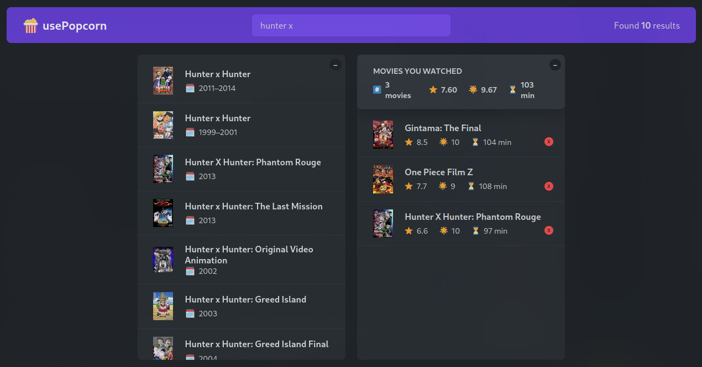

# **README - Penjelasan Komponen dan Fungsionalitas Aplikasi**

---

Selamat datang di dokumentasi komponen-komponen aplikasi! Di sini, saya akan menjelaskan berbagai komponen yang ada dalam aplikasi ini dengan cara yang mudah dipahami, khususnya bagi pemula yang baru belajar React dan JavaScript. Setiap komponen akan dijelaskan dengan cara berpikir React, analogi sederhana, penjelasan kode tiap baris, dan kesimpulan yang mudah dimengerti.

---

## 

## **1. Navbar**

### **Pengertian**

Komponen `Navbar` adalah bagian atas halaman yang biasanya berisi navigasi atau menu. Pada aplikasi ini, `Navbar` menyertakan logo dan komponen-komponen lain seperti `Search` dan `NumResults`.

### **Cara Berpikir React**

React bekerja dengan memecah tampilan aplikasi menjadi komponen-komponen kecil yang bisa digunakan kembali. Komponen `Navbar` menerima elemen anak melalui props `{ children }` dan menampilkan elemen tersebut di dalam tag `<nav>`.

### **Analogi Sederhana**

Bayangkan kamu pergi ke sebuah toko. Di bagian atas pintu masuk ada tanda yang bertuliskan nama toko dan menu pilihan yang bisa kamu pilih. `Navbar` berfungsi seperti tanda dan menu tersebut.

### **Penjelasan Code**

```jsx
export default function Navbar({ children }) {
  return (
    <nav className="nav-bar">
      <Logo />
      {children}
    </nav>
  );
}
```

- **`Logo`**: Merender logo aplikasi.
- **`{children}`**: Menampilkan elemen anak yang diberikan (misalnya, komponen pencarian dan hasil jumlah film).

### **Kesimpulan**

Komponen `Navbar` digunakan untuk menampilkan bagian atas aplikasi dengan logo dan elemen-elemen lain seperti form pencarian dan jumlah hasil pencarian.

---

## **2. Search**

### **Pengertian**

Komponen `Search` adalah tempat pengguna bisa memasukkan teks untuk mencari film di aplikasi. Komponen ini menerima dua props: `query` untuk menyimpan teks pencarian, dan `setQuery` untuk mengubah nilai teks pencarian.

### **Cara Berpikir React**

React mengikuti prinsip "state" dan "props". `Search` menerima `query` dan `setQuery` sebagai props untuk mengelola status pencarian yang dimasukkan oleh pengguna.

### **Analogi Sederhana**

Bayangkan kamu menggunakan mesin pencari di internet, seperti Google. Kamu mengetikkan kata kunci di kotak pencarian dan hasilnya muncul. `Search` bertindak seperti kotak pencarian tersebut.

### **Penjelasan Code**

```jsx
export default function Search({ query, setQuery }) {
  return (
    <input
      className="search"
      type="text"
      placeholder="Search movies..."
      value={query}
      onChange={(e) => setQuery(e.target.value)}
    />
  );
}
```

- **`value={query}`**: Nilai input diikat dengan state `query`.
- **`onChange={(e) => setQuery(e.target.value)}`**: Ketika pengguna mengetik, fungsi `setQuery` dipanggil untuk memperbarui nilai `query`.

### **Kesimpulan**

Komponen `Search` menyediakan kotak pencarian yang memungkinkan pengguna untuk mengetik kata kunci dan memperbarui status pencarian dengan nilai yang baru.

---

## **3. MovieList**

### **Pengertian**

Komponen `MovieList` bertanggung jawab untuk menampilkan daftar film yang sesuai dengan pencarian pengguna. Komponen ini menerima props `movies` dan `onSelectMovie` untuk merender film dan menangani pemilihan film.

### **Cara Berpikir React**

Komponen `MovieList` merender daftar film yang diterima melalui props `movies`. Setiap item dalam daftar adalah komponen `Movie` yang menampilkan detail film.

### **Analogi Sederhana**

Bayangkan kamu melihat daftar film di sebuah bioskop. Setiap judul film dapat kamu pilih untuk mendapatkan informasi lebih lanjut. `MovieList` adalah daftar film tersebut, dan setiap film adalah item yang bisa dipilih.

### **Penjelasan Code**

```jsx
export default function MovieList({ movies, onSelectMovie }) {
  return (
    <ul className="list list-movies">
      {movies?.map((movie) => (
        <Movie movie={movie} key={movie.imdbID} onSelectMovie={onSelectMovie} />
      ))}
    </ul>
  );
}
```

- **`movies?.map()`**: Untuk setiap film dalam array `movies`, komponen `Movie` akan dirender.
- **`onSelectMovie={onSelectMovie}`**: Fungsi yang akan dijalankan saat film dipilih.

### **Kesimpulan**

Komponen `MovieList` merender daftar film berdasarkan hasil pencarian dan memungkinkan pengguna memilih film untuk melihat detail lebih lanjut.

---

## **4. MovieDetail**

### **Pengertian**

Komponen `MovieDetail` menampilkan detail lengkap mengenai film yang dipilih oleh pengguna. Komponen ini menunjukkan poster, deskripsi, rating, dan informasi lainnya mengenai film.

### **Cara Berpikir React**

Komponen ini bergantung pada props `selectedId` untuk mengetahui film mana yang sedang dipilih dan menampilkan informasinya. Komponen ini juga mengelola state untuk menandai apakah film sudah ditonton atau belum.

### **Analogi Sederhana**

Bayangkan kamu memilih sebuah film di bioskop. Setelah memilih film, layar besar akan menampilkan detail lengkap tentang film tersebut: deskripsi, pemeran, sutradara, dan rating. `MovieDetail` berfungsi seperti layar yang menampilkan informasi tersebut.

### **Penjelasan Code**

```jsx
export default function MovieDetail({
  selectedId,
  onCloseMovie,
  onAddWatched,
  watched,
}) {
  // Menampilkan detail film berdasarkan selectedId
}
```

- **`useEffect()`**: Mengambil data film dari API saat `selectedId` berubah.
- **`handleAdd()`**: Menambahkan film ke daftar yang sudah ditonton setelah diberi rating.

### **Kesimpulan**

Komponen `MovieDetail` menampilkan detail lengkap film yang dipilih, memberikan opsi untuk menambahkan rating, dan menyimpan film ke daftar yang sudah ditonton.

---

## **5. WatchedMovieList**

### **Pengertian**

Komponen `WatchedMovieList` menampilkan daftar film yang sudah ditonton oleh pengguna. Komponen ini juga memungkinkan pengguna untuk menghapus film dari daftar.

### **Cara Berpikir React**

Komponen ini menerima props `watched` yang berisi film-film yang telah ditonton dan memetakan setiap film menjadi elemen daftar yang dapat dihapus.

### **Analogi Sederhana**

Bayangkan kamu memiliki sebuah daftar film yang sudah kamu tonton dan ingin melihatnya lagi. Komponen `WatchedMovieList` adalah daftar film yang sudah ditonton tersebut, dan kamu bisa menghapus film jika tidak ingin melihatnya lagi.

### **Penjelasan Code**

```jsx
export default function WatchedMovieList({ watched, onDeleteWatched }) {
  return (
    <ul className="list">
      {watched.map((movie) => (
        <WatchMovie
          movie={movie}
          key={movie.imdbID}
          onDeleteWatched={onDeleteWatched}
        />
      ))}
    </ul>
  );
}
```

- **`watched.map()`**: Untuk setiap film dalam daftar `watched`, komponen `WatchMovie` dirender.
- **`onDeleteWatched={onDeleteWatched}`**: Fungsi untuk menghapus film dari daftar yang sudah ditonton.

### **Kesimpulan**

Komponen `WatchedMovieList` menampilkan daftar film yang telah ditonton dan memungkinkan pengguna untuk menghapus film yang tidak lagi ingin dilihat.

---

## **6. WatchedSummary**

### **Pengertian**

Komponen `WatchedSummary` memberikan ringkasan statistik mengenai film yang telah ditonton, seperti rata-rata rating IMDb, rating pengguna, dan durasi rata-rata film.

### **Cara Berpikir React**

Komponen ini menerima props `watched`, yang berisi daftar film yang sudah ditonton, dan menghitung rata-rata rating dan durasi film menggunakan fungsi `average`.

### **Analogi Sederhana**

Bayangkan kamu memiliki sebuah daftar nilai ujian dan ingin mengetahui rata-rata nilai ujian tersebut. `WatchedSummary` memberikan ringkasan statistik tentang film yang sudah ditonton, seperti rata-rata rating dan durasi.

### **Penjelasan Code**

```jsx
export default function WatchedSummary({ watched }) {
  const avgImdbRating = average(watched.map((movie) => movie.imdbRating));
  const avgUserRating = average(watched.map((movie) => movie.userRating));
  const avgRuntime = average(watched.map((movie) => movie.runtime));
  return <div className="summary">{/* Menampilkan ringkasan statistik */}</div>;
}
```

- **`average()`**: Fungsi untuk menghitung rata-rata nilai yang diberikan (rating IMDb, rating pengguna, dan durasi).

### **Kesimpulan**

Komponen `WatchedSummary` memberikan informasi statistik yang berguna bagi pengguna mengenai film yang telah mereka tonton, seperti rata-rata rating dan durasi.

---

## **Kesimpulan Umum**

Aplikasi ini dibangun dengan menggunakan React untuk mengelola tampilan dan interaksi pengguna. Setiap komponen bertanggung jawab untuk bagian tertentu dari aplikasi, seperti menampilkan daftar film, menampilkan detail film, dan menampilkan daftar film yang sudah ditonton. Dengan cara ini, aplikasi menjadi modular dan mudah untuk dipahami serta dikembangkan lebih lanjut.

Semoga penjelasan di atas membantu kamu
