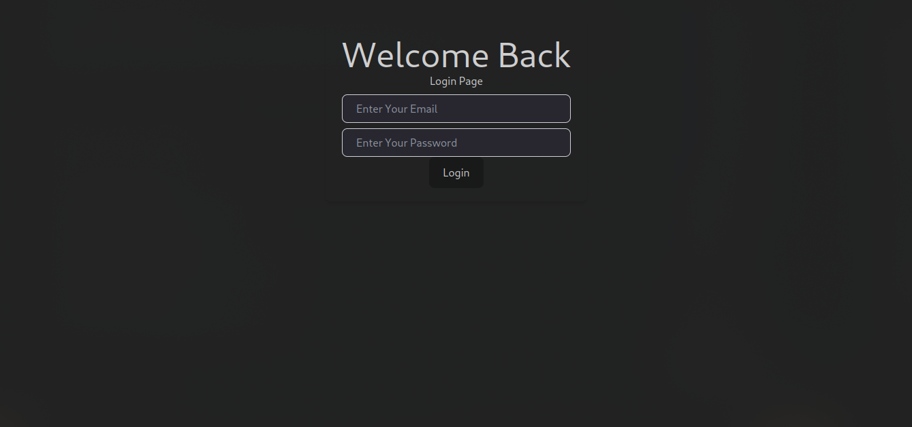
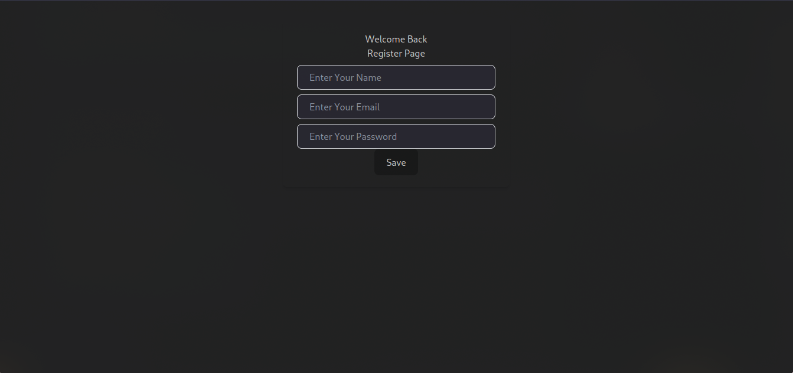
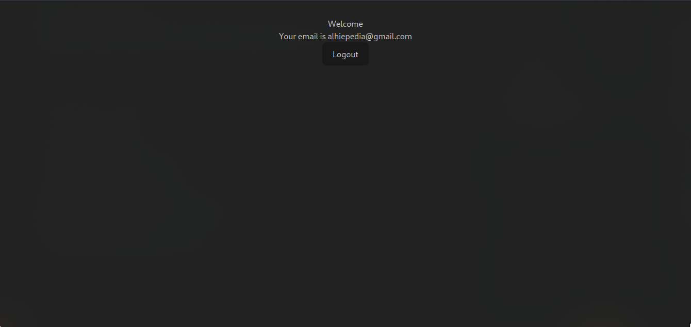

# React Firebase Authentication Project

## **Tujuan Proyek**

Proyek ini adalah aplikasi autentikasi pengguna menggunakan React dan Firebase. Pengguna dapat mendaftar, login, dan mengakses halaman profil setelah berhasil login. Halaman profil menampilkan nama pengguna dan email yang tersimpan di Firebase. Pengguna juga dapat keluar dari aplikasi kapan saja.

### **Fitur Utama:**

- Pendaftaran pengguna baru menggunakan email dan password.
- Login pengguna menggunakan email dan password.
- Profil pengguna yang menampilkan nama dan email setelah login.
- Halaman login hanya bisa diakses oleh pengguna yang belum login.
- Halaman profil hanya bisa diakses oleh pengguna yang sudah login.
- Fungsi logout untuk mengakhiri sesi pengguna.

---

## **Prasyarat**

Sebelum memulai, pastikan Anda memiliki perangkat yang memenuhi prasyarat berikut:

- **Node.js** (versi 14 atau lebih baru) terinstal di komputer Anda.
- **Firebase Project** dengan konfigurasi Firebase Authentication (Email dan Password) yang sudah diatur.
- **NPM** atau **Yarn** untuk mengelola dependensi.

---

## **Instalasi**

Ikuti langkah-langkah di bawah untuk menginstal dan menjalankan proyek ini di mesin lokal Anda:

### 1. **Clone Repository**

Clone repositori ini ke dalam mesin lokal Anda:

```bash
git clone https://github.com/alhiefikri/react-from-sratch.git
```

### 2. **Masuk ke Direktori Proyek**

Pindah ke direktori proyek:

```bash
cd project-name
```

### 3. **Instalasi Dependensi**

Instal dependensi yang diperlukan dengan NPM atau Yarn:

```bash
npm install
# atau
yarn install
```

### 4. **Pengaturan Firebase**

1. Masuk ke Firebase Console di [Firebase Console](https://console.firebase.google.com/).
2. Buat proyek baru atau pilih proyek yang sudah ada.
3. Aktifkan Firebase Authentication dengan metode "Email/Password".
4. Ambil konfigurasi Firebase dari `Project Settings` -> `Config` dan masukkan ke dalam file `firebaseConfig.js`.

**Contoh konfigurasi Firebase**:

```javascript
// firebaseConfig.js
import { initializeApp } from "firebase/app";
import { getAuth } from "firebase/auth";

const firebaseConfig = {
  apiKey: "YOUR_API_KEY",
  authDomain: "YOUR_AUTH_DOMAIN",
  projectId: "YOUR_PROJECT_ID",
  storageBucket: "YOUR_STORAGE_BUCKET",
  messagingSenderId: "YOUR_MESSAGING_SENDER_ID",
  appId: "YOUR_APP_ID",
};

const app = initializeApp(firebaseConfig);
const auth = getAuth(app);

export { auth };
```

### 5. **Menjalankan Aplikasi**

Setelah semuanya siap, jalankan aplikasi dengan perintah berikut:

```bash
npm start
# atau
yarn start
```

Aplikasi akan terbuka di browser pada [http://localhost:3000](http://localhost:3000).

---

## **Struktur Proyek**

Berikut adalah struktur direktori proyek:

```
/project-name
│
├── /public
│   └── index.html            # File HTML utama
│
├── /src
│   ├── /components           # Folder untuk komponen UI reusable
│   │   ├── CommonInput.js    # Komponen input umum
│   │   └── CommonForm.js     # Komponen form umum
│   │
│   ├── /config               # Konfigurasi form dan pengaturan
│   │   └── config.js         # Form kontrol untuk login dan registrasi
│   │
│   ├── /context              # Context untuk manajemen state autentikasi
│   │   └── AuthContext.js    # Context untuk autentikasi dan manajemen sesi
│   │
│   ├── /pages                # Folder untuk halaman-halaman aplikasi
│   │   ├── LoginPage.js      # Halaman login
│   │   ├── RegisterPage.js   # Halaman registrasi
│   │   ├── ProfilePage.js    # Halaman profil pengguna
│   │   └── PrivateRoute.js   # Komponen untuk melindungi rute profil
│   │
│   ├── App.js                # Komponen utama aplikasi
│   ├── firebaseConfig.js     # Konfigurasi Firebase
│   └── index.js              # Entry point aplikasi
│
└── package.json              # File dependensi dan pengaturan proyek
```

---

## **Penjelasan Komponen**

### 1. **App.js**

Komponen utama yang menangani routing aplikasi. Menggunakan `react-router-dom` untuk navigasi antara halaman login, registrasi, dan profil.

- **Halaman Login**: `LoginPage` - untuk pengguna yang belum login.
- **Halaman Registrasi**: `RegisterPage` - untuk pengguna baru yang ingin membuat akun.
- **Halaman Profil**: `ProfilePage` - untuk pengguna yang sudah login.
- **Private Route**: `AuthPage` - untuk melindungi rute profil dan hanya membolehkan akses jika pengguna sudah login.

### 2. **AuthContext.js**

Komponen Context untuk mengelola status autentikasi pengguna di seluruh aplikasi. Menggunakan `useContext` untuk menyediakan data login dan registrasi, serta fungsi untuk mengelola sesi pengguna.

### 3. **CommonForm.js dan CommonInput.js**

Komponen UI umum yang digunakan untuk membuat elemen formulir. Komponen ini digunakan untuk membuat input form pada halaman login dan registrasi.

### 4. **LoginPage.js**

Halaman yang memungkinkan pengguna untuk login menggunakan email dan password.

### 5. **RegisterPage.js**

Halaman untuk mendaftar pengguna baru. Setelah registrasi berhasil, nama pengguna ditambahkan ke profil Firebase dan pengguna diarahkan ke halaman profil.

### 6. **ProfilePage.js**

Menampilkan informasi profil pengguna yang sudah login, seperti nama dan email. Pengguna dapat logout melalui halaman ini.

### 7. **PrivateRoute.js**

Komponen untuk melindungi rute yang hanya dapat diakses oleh pengguna yang sudah login. Jika pengguna belum login, mereka akan diarahkan ke halaman login.

---

## **Screenshot Aplikasi**

Berikut adalah screenshot dari aplikasi yang sudah berjalan:

1. **Halaman Login:**
   

2. **Halaman Registrasi:**
   

3. **Halaman Profil:**
   

---

## **Kesimpulan**

Aplikasi ini memungkinkan pengguna untuk mendaftar, login, dan melihat profil mereka setelah berhasil login. Menggunakan Firebase Authentication untuk menangani autentikasi dan React untuk UI dan manajemen routing. Fitur keamanan seperti **private route** memastikan hanya pengguna yang sudah login yang dapat mengakses halaman profil.

---

Jika Anda menemui masalah atau ingin memberikan saran perbaikan, silakan buka **issue** di repositori ini atau kirimkan pull request!

---
