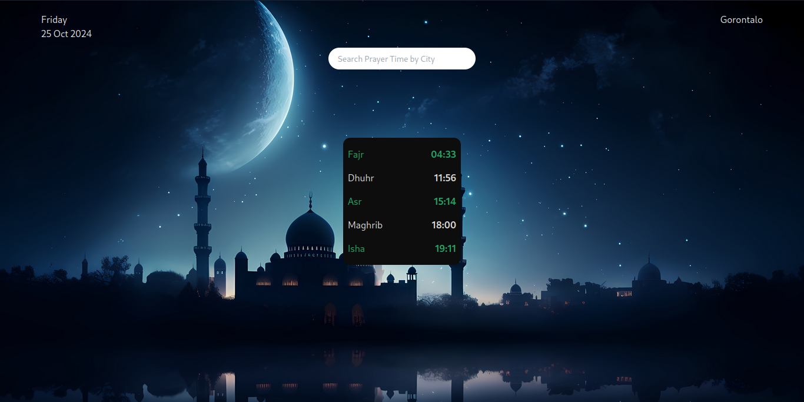

# Dokumentasi Detail Prayer Time App React



## Struktur Import dan Setup Awal

```javascript
/* eslint-disable react/jsx-key */
import { useEffect } from "react";
import "./App.css";
import { useState } from "react";
```

**Penjelasan:**

- ESLint disable untuk react/jsx-key: Menonaktifkan warning tentang key dalam list rendering
- Import hooks yang digunakan:
  - `useEffect`: Untuk menangani API calls
  - `useState`: Untuk state management

## State Management

```javascript
const [input, setInput] = useState(""); // State untuk input pencarian
const [term, setTerm] = useState("Jakarta"); // State untuk kota aktif
const [data, setData] = useState({}); // State untuk data waktu sholat
const prayerTime = ["Fajr", "Dhuhr", "Asr", "Maghrib", "Isha"]; // Array waktu sholat
```

**Penjelasan Detail State:**

1. **input State:**

   - Menyimpan nilai input field
   - Diupdate setiap kali user mengetik
   - Direset setelah form submission

2. **term State:**

   - Menyimpan nama kota yang aktif
   - Default: "Jakarta"
   - Digunakan sebagai parameter API call
   - Diupdate saat form disubmit

3. **data State:**

   - Menyimpan response dari API Aladhan
   - Struktur object kompleks dengan informasi waktu sholat dan tanggal
   - Default: object kosong {}

4. **prayerTime Array:**
   - Array statis berisi nama-nama waktu sholat
   - Digunakan untuk mapping data waktu sholat
   - Urutan sesuai waktu sholat dalam sehari

## API Integration dengan useEffect

```javascript
useEffect(() => {
  fetch(`http://api.aladhan.com/v1/timingsByAddress?address=${term}`)
    .then((res) => res.json())
    .then((res) => setData(res.data));
}, [term]);
```

**Penjelasan Detail:**

1. **Timing Eksekusi:**

   - Dijalankan saat komponen pertama mount
   - Dijalankan ulang setiap kali `term` berubah
   - Dependency array `[term]` mengontrol re-render

2. **API Endpoint:**
   - Base URL: `http://api.aladhan.com/v1/timingsByAddress`
   - Parameter: `address=${term}` untuk mencari berdasarkan kota
   - Response structure:
     ```javascript
     {
       data: {
         timings: { Fajr: "04:30", Dhuhr: "12:00", ... },
         date: {
           readable: "01 Jan 2024",
           gregorian: { weekday: { en: "Monday" }, ... }
         }
       }
     }
     ```

## Layout dan UI Components

### 1. Container Utama

```javascript
<div className="flex h-screen flex-col items-center justify-center gap-5
                bg-[url('./assets/bg-pray.jpg')] bg-cover text-white">
```

**Penjelasan:**

- Layout flexbox dengan orientasi kolom
- Menggunakan seluruh tinggi layar (`h-screen`)
- Background image dari assets
- Gap 5 units antara elemen
- Text warna putih

### 2. Header Section

```javascript
<div className="absolute top-5 flex w-full flex-col items-center justify-between gap-3">
  <div className="flex w-full justify-between px-[70px] text-[#e3e6e3]">
    <div className="">
      <div className="">{data.date && data.date.gregorian.weekday.en}</div>
      <div className="">{data.date && data.date.readable}</div>
    </div>
    <div className="">{term}</div>
  </div>
  {/* Form component */}
</div>
```

**Penjelasan:**

1. **Positioning:**

   - `absolute top-5`: Posisi fixed di bagian atas
   - `w-full`: Mengambil seluruh lebar container

2. **Date Display:**

   - Menampilkan hari dalam bahasa Inggris
   - Menampilkan tanggal dalam format readable
   - Conditional rendering dengan `data.date &&`

3. **Location Display:**
   - Menampilkan kota aktif dari state `term`
   - Posisi di sebelah kanan header

### 3. Search Form

```javascript
<form
  onSubmit={(e) => {
    e.preventDefault();
    setTerm(input);
    setInput("");
  }}
>
  <input
    onChange={(e) => setInput(e.target.value)}
    value={input}
    type="text"
    placeholder="Search Prayer Time by City"
    className="w-[250px] rounded-full px-4 py-2 text-[14px] text-slate-400 outline-none focus:italic focus:shadow-lg"
  />
  <input type="submit" value="" />
</form>
```

**Penjelasan Form:**

1. **Form Handling:**

   - `e.preventDefault()`: Mencegah page reload
   - Update `term` dengan nilai input
   - Reset input field

2. **Input Field:**
   - Controlled component dengan `value={input}`
   - Width 250px dengan rounded corners
   - Styling focus state
   - Placeholder text informatif

### 4. Prayer Times Display

```javascript
<div>
  <ul className="flex w-[200px] flex-col rounded-xl bg-[#0d0d0d] py-2">
    {data &&
      prayerTime.map((p) => {
        return (
          <li className="flex justify-between p-2 odd:text-[#26a767] even:text-[#dbdbd9]">
            <div>{p}</div>
            <div className="font-bold">
              {data.timings && data.timings[`${p}`]}
            </div>
          </li>
        );
      })}
  </ul>
</div>
```

**Penjelasan Prayer Times:**

1. **Container Styling:**

   - Width 200px
   - Background hitam transparan
   - Rounded corners
   - Padding vertical 2 units

2. **List Rendering:**
   - Map melalui array `prayerTime`
   - Setiap item menampilkan:
     - Nama waktu sholat
     - Waktu dari `data.timings`
3. **Styling Alternating:**
   - Odd items: Warna hijau (#26a767)
   - Even items: Warna putih (#dbdbd9)
   - Layout flex dengan justify-between

## Data Flow dan Logika

1. **Initial Load:**

   ```javascript
   // Saat pertama load:
   term = "Jakarta"  // Default city
   → useEffect triggered
   → API call untuk Jakarta
   → Update data state
   → Render UI dengan data Jakarta
   ```

2. **User Search:**

   ```javascript
   // User mengetik kota
   input updates → User submits form
   → term updates to input value
   → useEffect triggered
   → New API call
   → Update data state
   → Re-render UI
   ```

3. **Data Processing:**
   ```javascript
   // Struktur data yang digunakan
   data = {
     timings: {
       Fajr: "04:30",
       Dhuhr: "12:00",
       Asr: "15:15",
       Maghrib: "18:00",
       Isha: "19:15",
     },
     date: {
       readable: "01 Jan 2024",
       gregorian: {
         weekday: {
           en: "Monday",
         },
       },
     },
   };
   ```

## Tips Pengembangan

1. **Error Handling:**

   ```javascript
   useEffect(() => {
     fetch(`http://api.aladhan.com/v1/timingsByAddress?address=${term}`)
       .then((res) => {
         if (!res.ok) throw new Error("City not found");
         return res.json();
       })
       .catch((error) => {
         console.error("Error:", error);
         // Tambahkan state untuk handling error
       });
   }, [term]);
   ```

2. **Loading State:**

   ```javascript
   const [isLoading, setIsLoading] = useState(false);

   useEffect(() => {
     setIsLoading(true);
     fetch(URL)
       .then(...)
       .finally(() => setIsLoading(false));
   }, [term]);
   ```

3. **Input Validation:**
   ```javascript
   const handleSubmit = (e) => {
     e.preventDefault();
     if (input.trim() === "") return;
     setTerm(input);
     setInput("");
   };
   ```

## Optimisasi

1. **Memoization:**

   ```javascript
   const memoizedPrayerTimes = useMemo(() => {
     return prayerTime.map((p) => ({
       name: p,
       time: data.timings?.[p],
     }));
   }, [data.timings]);
   ```

2. **Custom Hook:**
   ```javascript
   const usePrayerTimes = (city) => {
     const [data, setData] = useState({});
     useEffect(() => {
       // API call logic
     }, [city]);
     return data;
   };
   ```

## Testing Considerations

1. **Component Testing:**

   ```javascript
   test("renders prayer times correctly", () => {
     const mockData = {
       timings: {
         Fajr: "04:30",
         Dhuhr: "12:00",
       },
     };
     // Test rendering dengan mock data
   });
   ```

2. **Form Testing:**
   ```javascript
   test("handles city search correctly", () => {
     // Test input change
     // Test form submission
     // Test API call trigger
   });
   ```

## Kesimpulan

Prayer Time App ini mendemonstrasikan:

1. Clean dan efficient state management
2. API integration yang efektif
3. Conditional rendering
4. Responsive design
5. Form handling
6. List rendering dengan mapping
7. Styling dengan Tailwind CSS

Aplikasi ini bisa dikembangkan lebih lanjut dengan:

1. Tambahan fitur lokasi otomatis
2. Notifikasi waktu sholat
3. Kalender hijriah
4. Mode offline
5. Multiple bahasa

Setiap bagian kode memiliki peran spesifik dan bekerja bersama membentuk aplikasi yang fungsional dan user-friendly.
