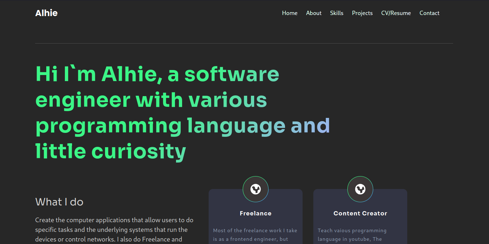

# Portfolio Website Documentation

Website portofolio personal yang menampilkan informasi profesional, keterampilan, dan proyek-proyek yang telah dikerjakan. Dirancang dengan pendekatan modern menggunakan React dan Tailwind CSS.



## Fitur Utama

- Navigasi responsif
- Section: Home, About, Skills, Projects, Contact
- Responsive design (Mobile & Desktop)
- Pemisahan section yang jelas dengan divider

## Teknologi yang Digunakan

- React.js
- Tailwind CSS
- JavaScript ES6+

## Struktur Komponen

### Component Import

```javascript
import "./App.css";
import Navbar from "./components/Navbar"; // Komponen navigasi
import Main from "./components/Main"; // Komponen halaman utama
import About from "./components/About"; // Komponen about
import Skills from "./components/Skills"; // Komponen skills
import Projects from "./components/Projects"; // Komponen projects
import Contact from "./components/Contact"; // Komponen contact
```

### Komponen Utama

#### 1. Container Utama

```javascript
<div
  id="porto"
  className="flex w-full flex-col bg-black-2 px-[30px] md:px-[100px]"
>
  {/* Konten Website */}
</div>
```

- Container flex untuk layout utama
- Background hitam custom
- Padding responsif:
  - Mobile: 30px
  - Desktop: 100px

#### 2. Content Wrapper

```javascript
<div className="mt-[70px] md:mt-[100px]">{/* Konten Section */}</div>
```

- Margin top responsif:
  - Mobile: 70px
  - Desktop: 100px
- Membungkus semua section konten

#### 3. Section Divider

```javascript
<hr className="my-5 h-[1px] border-none bg-[#4D4D4D]" />
```

- Pemisah visual antar section
- Tinggi 1px
- Warna abu-abu (#4D4D4D)
- Margin vertical 5 unit

### Struktur Section

1. **Navbar**

   - Navigasi website
   - Posisi: Fixed top
   - Path: `./components/Navbar`

2. **Main**

   - Landing page/Homepage
   - Section pertama setelah navbar
   - Path: `./components/Main`

3. **About**

   - Informasi personal/profesional
   - Path: `./components/About`

4. **Skills**

   - Daftar keterampilan teknis
   - Path: `./components/Skills`

5. **Projects**

   - Portfolio proyek
   - Path: `./components/Projects`

6. **Contact**
   - Informasi kontak
   - Path: `./components/Contact`

### Styling Features

1. Layout System

```javascript
className = "flex w-full flex-col";
```

- Menggunakan Flexbox
- Full width layout
- Orientasi column

2. Responsive Design

```javascript
px-[30px]     // Mobile padding
md:px-[100px] // Desktop padding (min-width: 768px)
```

- Mobile-first approach
- Breakpoint tablet/desktop: 768px

3. Spacing System

```javascript
mt-[70px]     // Mobile margin top
md:mt-[100px] // Desktop margin top
my-5          // Section divider margin
```

- Konsisten spacing
- Responsif untuk berbagai ukuran layar

## Cara Penggunaan

1. Import komponen:

```javascript
import App from "./App";
```

2. Render di root:

```javascript
ReactDOM.render(<App />, document.getElementById("root"));
```

## Setup Project

1. Install dependencies:

```bash
npm install
```

2. Jalankan aplikasi:

```bash
npm start
```

## Tips Pengembangan

1. Tambahkan animasi scroll
2. Implementasikan dark/light mode
3. Tambahkan interaksi user yang lebih dinamis
4. Optimalkan performa loading
5. Tambahkan internasionalisasi (i18n)

## Best Practices

1. Gunakan semantic HTML
2. Optimasi gambar
3. Implementasi lazy loading
4. Maintain konsistensi spacing
5. Gunakan CSS utility classes dengan bijak
